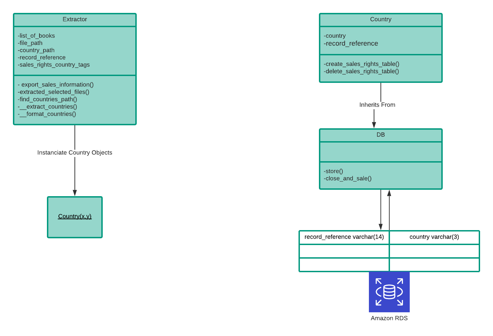

# Perlego Developer Assessment
### Task
"For the challenge, we would like you to determine what countries each of the 4 books in the sample data set can be sold in."

My solution is a simple command-line interface that allows you to perform simple operations to determine the countries where you can sell each book.

## Design

### Class Extractor
This is class is has 5 attributes and 4 methods. It was built allowing it to have the capability of affording general extraction operations.

* The find_countries_path() calculates the XML path until it finds the tags that we set in the attribute fetch_tags.

* The export_sales_information() iterates through each file the path you want to reach and has as the root variable the XML element you won't operate on.  

* It also has two private methods that are directly related to the country extraction.

### Class Db
This class has two simple methods for session handling. The logic behind creating this class is that if I were to create more tables they would all inherit these Db() methods.

I used AWS Rds to host a free tier Mysql db.

### Class Country
This class is responsible for creating and deleting the country_books table, it is being used to instantiate objects of his type to be session added and committed to mysqldb.

The country_books table has a primary key (record_reference, country). 

## Setting up and Installation (Ubuntu)
There are two different ways of running the project. If you are not using Ubuntu I recommend you use Docker.
* Using Docker

        1.Install Docker ---> https://docs.docker.com/engine/install/
        2.Make sure you are in the project root -> $ cd 'Perlego Challenge'
        3.$ docker build -t challenge .
        4.Run Docker in -it mode -->$ docker run -it -t challenge /bin/bash
        5.Check if you are in the root directory -> $ ls

* Using Pipenv

        1.If you don't have pipenv install
            1.1 $pip install pipenv
        2.$ pipenv install
        3.$ pipenv shell

## Usage
    These 3 click options that can be used simultaneously.
    
*   --book or -b

        -This allows you to select each book stored in /data .
        -The default value is all, which selects them all.
        E.g:
         -python3 cli.py -b 1.xml -b 2.xml      (selects book 1 and 2)
         -python3 cli.py      (selects all)
    
*   --log-info or -lf

        -This allows you to turn on and off the logging.
        -The default value is True.
        E.g:
        -python3 cli.py -lf false
    
*   --delete-table or -dt

        -This allows you to reset the table where the values are being added.
        -The default value is None.
        E.g:
        -python3 cli.py -dt country_books
    
    Some random example:
        -python3.cli -b 1.xml 4.xml -dt country_books -lf false

        This would reset the table, insert countries for books 1 and 4 and wouldn't log anything.
    
### Testing

    1. $ python3 -m unitest

    Tests the functionality around the Extractor class.

